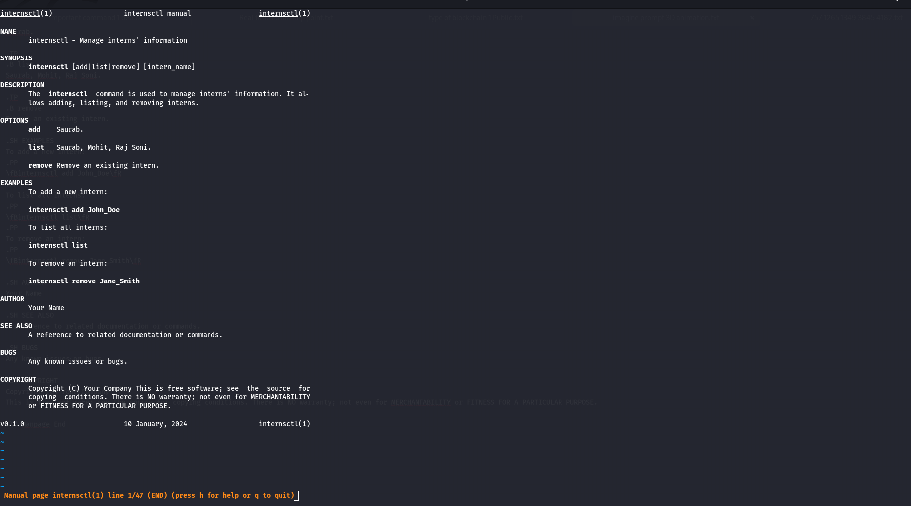
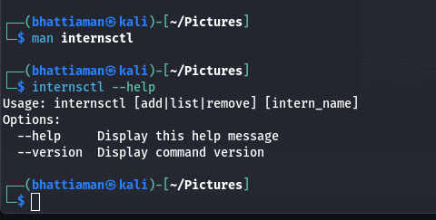
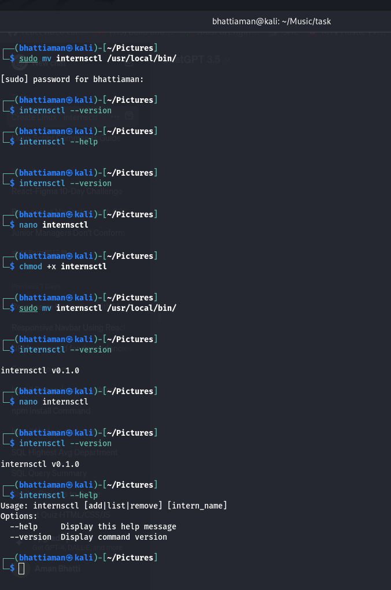

# taskx
# Repository Name

## Section A

### Steps

1. Open terminal and create a file named `internsctl` using `nano internsctl`.
2. Modify the content of the file as per your data.

    ```bash
    cat << 'EOF' > internsctl
    #!/bin/bash

    # Functions and script content...

    EOF
    ```

3. Grant executable permissions to the `internsctl` file using `chmod +x internsctl`.
4. Move the `internsctl` file to `/usr/local/bin/` using `sudo mv internsctl /usr/local/bin/`.
5. Update the manual pages using `sudo mandb`.
6. Task - 1: View the manual of `internsctl` using `man internsctl`.
7. Task - 2: Get help using `internsctl --help`.
8. Task - 3: Check the version using `internsctl --version`.

### man internsctl




## Section B

### Code of part 1

```python
import subprocess

# Function definitions...

if __name__ == "__main__":
    command = input("Enter command: ")  # This can be "internsctl cpu getinfo" or "internsctl memory getinfo"
    output = internsctl(command)
    print(output)
```

I want to get cpu information of my server through the following command:
$ internsctl cpu getinfo
Expected Output -
I want similar output as we get from lscpu command
---
I want to get memory information of my server through the following command:
$ internsctl memory getinfo


# Code for part 2


simple commands play with the root and the user name
I want to create a new user on my server through the following command:
$ internsctl user create <username>
Note - above command should create user who can login to linux system and access his home
directory

I want to list all the regular users present on my server through the following command:
$ internsctl user list

If want to list all the users with sudo permissions on my server through the following command:
$ internsctl user list --sudo-only

Part3 | Advanced Level
```By executing below command I want to get some information about a file
$ internsctl file getinfo <file-name>
Expected Output [make sure to have the output in following format only]
xenonstack@xsd-034:~$ internsctl file getinfo hello.txt
File: hellot.txt
Access: -rw-r--r--
Size(B): 5448
Owner: xenonstack
Modify: 2020-10-07 20:34:44.616123431 +0530
In case I want only specific information then I must have a provision to use options
$ internsctl file getinfo [options] <file-name>
--size, -s to print size
--permissions, -p print file permissions
--owner, o print file owner
--last-modified, m
```


# Xenonstack-task